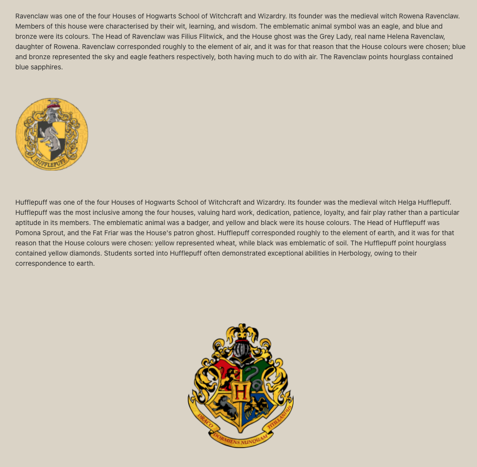

# Sorting hat -> iSortingHat
Hello, 
This is a small, short-term pet project. 
The main goal was to create an API for a random school by using Spring framework, maven, creating Students model, and CRUD Rest endpoints for the students.
I wanted to make this project a bit more interesting, so I thought I will make the "Sorting hat" 2.0... the iSorting_Hat! 
A brand new way for students to make know more about their school, their teachers, and about each other. 
No need to have one of "The Marauder's Map" to know where is your mate, and no more unknown faces in the dark corridors of Hogwarts.

# Technology Stack:
- Spring Boot
- Java 8
- Docker
- Bootstrap
- Angular

# Homepage
   
# Students
All the data for the Students are coming from an API (http://hp-api.herokuapp.com/api/characters/students)
The data from this API is not the best .. (there is no good API) .. so I have to filter them by some preferences. 
To make the page faster, after I got all the necessary data an Entity will be created and saved to our local DB, so next time we don't have to search for the 
valuable data. 

# Teachers 
The teacher Entity is created and saved to your local DB right after the project is started.
You can see the teachers names and positions in the school, and by clicking on the 'Profile' button you can find more details about their work or life.
   
# Map

# History
   

